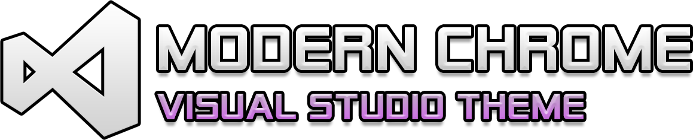
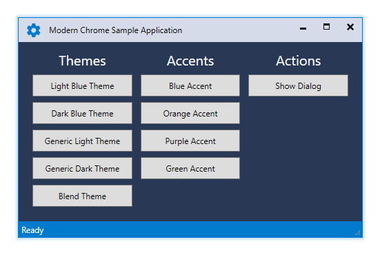
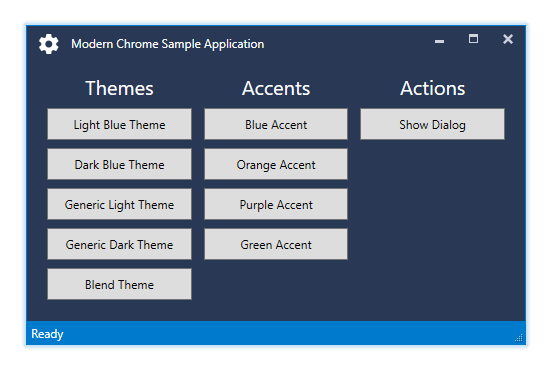
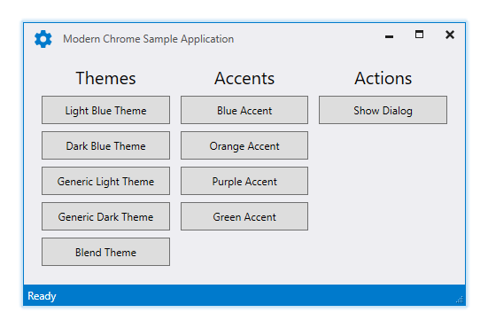
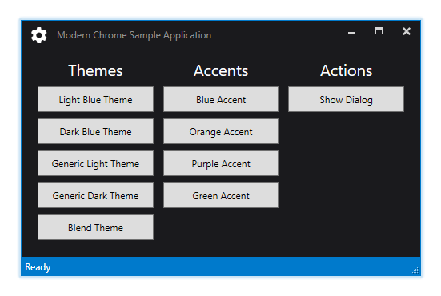
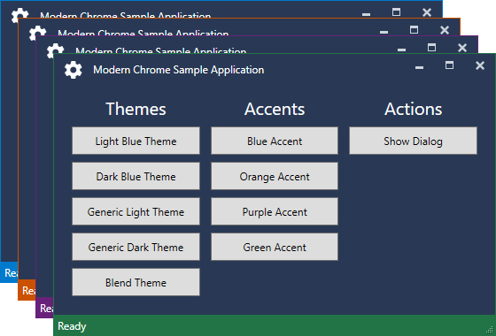
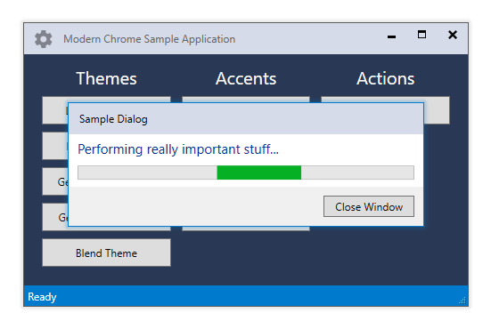

#

Modern Chrome is a library for .NET WPF applications that provides a custom `ModernWindow` base class for windows that mimics the look of Visual Studio 2017 with a custom chrome and glowing borders. The library does **NOT** *(at least not yet...)* provide styles and control templates for general controls and only styles the base window and its chrome.

# Screenshots

## Themes

The library currently supports the five themes `LightBlue`, `DarkBlue`, `Light`, `Dark` and `Blend`.







## Accents

The following screenshot displays the predefined accent colors which can be customized:



## Dialogs

The following screenshot shows a sample dialog and how the main window in the background loses its colored border as well as having the icon and text appear in a disabled state:



# Quick Start

Follow this short guide on getting started quickly - **it is HIGHLY suggested to browse the sample application for further customization and usage**.

## Setting up the project

1. Since there is no *ModernChrome* NuGet package yet, you have to download the project from the repository and add it to your solution as well as a reference to it.
2. In your `App.xaml` of your main application you have to add one of the available theme `ResourceDictionaries` with the following snippet while picking one of the available themes (IntelliSense will provide support for selecting a theme and you can either select `LightBlue.xaml`, `DarkBlue.xaml`, `Light.xaml`, `Dark.xaml` or `Blend.xaml`):
```xaml
<ResourceDictionary>
    <ResourceDictionary.MergedDictionaries>
        <ResourceDictionary Source="pack://application:,,,/ModernChrome;component/Themes/LightBlue.xaml" />
    </ResourceDictionary.MergedDictionaries>
</ResourceDictionary>
```
3. In your `MainWindow.xaml` you have to reference the *ModernChrome* namespace and change the window class to `ModernWindow` in the XAML file (and your `MainWindow.xaml.cs` if you happen to redudantly explicitly inherit from the previous `Window`):
```xaml
<modern:ModernWindow x:Class="ModernChrome.Sample.MainWindow"
                     xmlns="http://schemas.microsoft.com/winfx/2006/xaml/presentation"
                     xmlns:x="http://schemas.microsoft.com/winfx/2006/xaml"
                     xmlns:modern="clr-namespace:ModernChrome;assembly=ModernChrome"
                     Title="Modern Chrome Sample Application" Height="350" Width="500">
    <!-- ... -->
</modern:ModernWindow>
```
```csharp
namespace ModernChrome.Sample
{
    public partial class MainWindow : ModernWindow // this can be dropped anyways
    {
        public MainWindow()
        {
            InitializeComponent();
        }
    }
}
```

## Customizations

### Themes

The application theme can be selected via the `ResourceDictionary` imported in the `App.xaml` or during runtime by calling

```csharp
ModernChrome.ThemeManager.ChangeTheme(Application.Current, theme);
```

where `theme` is a string to an available theme. Currently you can select `LightBlue`, `DarkBlue`, `Light`, `Dark` or `Blend`. Previously loaded themes are automatically removed from the `Application.Resources.MergedDictionaries` and the new theme is injected automatically.

Furthermore you can track theme changes during runtime through the exposed `ModernChrome.ThemeManager.ThemeChanged` event which provides a `ThemeChangedEventArgs` holding the name of the newly loaded theme. Listening to the event is showed in the sample application:

```csharp
ModernChrome.ThemeManager.ThemeChanged += (sender, args) =>
{
    if (args.Theme != "Light")
    {
        ThemeText.Foreground = Brushes.White;
        AccentText.Foreground = Brushes.White;
        ActionText.Foreground = Brushes.White;
    }
    else
    {
        ThemeText.Foreground = Brushes.Black;
        AccentText.Foreground = Brushes.Black;
        ActionText.Foreground = Brushes.Black;
    }
};
```

Although the themes do provide a `Background` color for `ModernWindow`s you can define your custom color if necessary, it won't be overwritten.

### Status bar and glowing border (Accent)

`ModernWindow` provides a default status bar if you don't disable it manually via the `ModernWindow.ShowStatusBar` dependency property. Both the status bar color and the glowing border are bound to the `ModernWindow.BorderBrush` property.

If you opt-in to use the default status bar that comes with the library you can add controls to it via the `ModernWindow.StatusBar` dependency property:

```csharp
<modern:ModernWindow.StatusBar>
    <TextBlock VerticalAlignment="Center">Ready</TextBlock>
</modern:ModernWindow.StatusBar>
```

The `ContentPresenter` that displays your custom content stores the current suggested `Foreground` via `TextBlock.Foreground="{DynamicResource StatusBarTextBrushKey}"` and thus making sure that `TextBlock` controls always inherit a color that will be readable **IF** you use default `BorderBrush` colors. Otherwise you have to adjust the colors yourself.

Once again the themes do provide a default `BorderBrush` color for `ModernWindow`s but you can define your custom color if necessary, it won't be overwritten.

### Window icon

The window icon, internally refered to as caption icon, can be hidden using the `ModernWindow.ShowCaptionIcon` property which is useful for dialog windows. The window title bar will adjust accordingly depending on the value of the property.

A custom caption icon is automatically displayed with the dimensions 20 x 20 and it is recommended to use a `Path` control for scalable icons. Similiar to the status bar you can define your icon as follows:

```csharp
<modern:ModernWindow.CaptionIcon>
    <Path UseLayoutRounding="True" SnapsToDevicePixels="True" Stretch="UniformToFill"
          Fill="{Binding Path=(TextBlock.Foreground), RelativeSource={RelativeSource AncestorType={x:Type ContentPresenter}}}"
          Data="..." />
</modern:ModernWindow.CaptionIcon>
```

You might wonder about the `Fill="{Binding Path=(TextBlock.Foreground), RelativeSource={RelativeSource AncestorType={x:Type ContentPresenter}}}"`. The different themes used in the library have different colors depending on the `Window.IsActive` value. E.g. with the `LightBlue` theme my icon will generally appear in blue unless the window has lost focus which turns the icon gray. It is suggested to bind against this color in order to visually highlight when the window has lost focus.

### Window command buttons (Minimize, Maximize, Restore, Close)

Usually a window enables or disables those buttons depending on the value of `Window.ResizeMode` however `ModernWindow` handles this slightly different, since it does not only disable those buttons, it removes them entirely. Furthermore it provides the `ModernWindow.ShowCloseButton` property to hide the close button as well for convenience which would usually need P/Invoke calls. Keep in mind though, that Alt + F4 will most likely still work and you have to intercept the `Closing` event and abort it if necessary.

# Dependencies
The library does not reinvent the wheel, it only combines and strips the functionality of the following available packages:
* [Expression.Blend.Sdk.WPF](https://www.nuget.org/packages/Expression.Blend.Sdk.WPF/)
* [MahApps.Metro](https://github.com/MahApps/MahApps.Metro)

*MetroChrome* reuses the `BorderlessWindowBehavior` and a customized `GlowWindowBehavior` from the *MahApps.Metro* library to provide a window that can be easily resized and handled using AeroSnap and has a glowing border.

# Important Notice
Neither I nor the *ModernChrome* library are affiliated with, sponsored by, endorsed or approved by Microsoft. This project only mimics the style of Visual Studio and provides resources for custom applications.

**Visual Studio and its logo are registered trademarks of the Microsoft Corporation.**

# License
This project is licensed under the [MIT License](./LICENSE).
